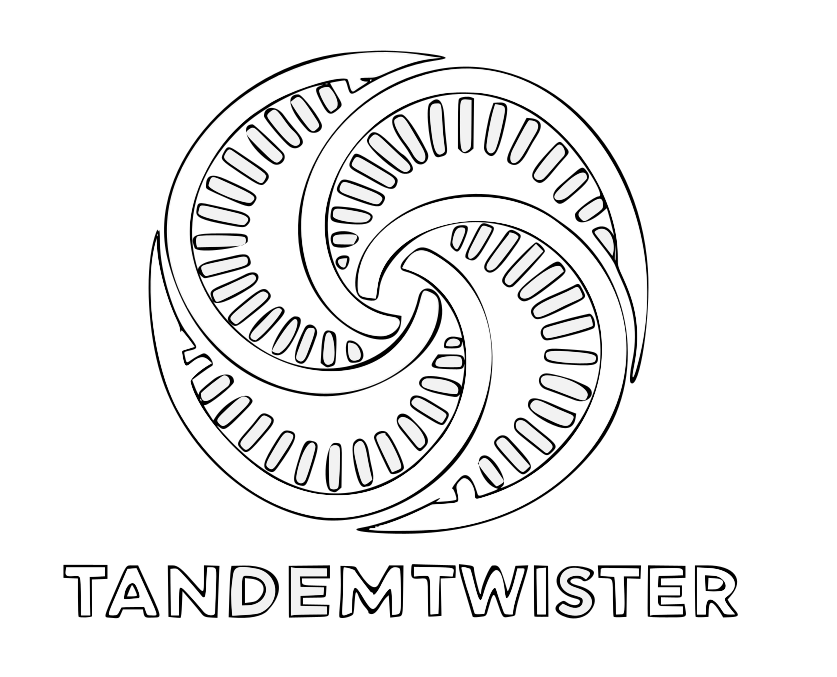

<html>
<head>
 <meta name="google-site-verification" content="Fq4C_Fkmju44GXVeW2otbQB29bgU6nYfPrjctY2lEzg" />
</head>
<body>
</body>
</html>
<a name="readme-top"></a>

<br />
<div align="center">
 
</div>
<br />
<div align="center">

  <p>TandemTwister is a fast tool for tandem repeat genotyping!</p>
  <p>
    ·
    <a href="https://github.com/Lionward/TandemTwister/issues">Report Bug</a>
    ·
    <a href="https://github.com/Lionward/TandemTwister/pulls">Request Feature</a>
  </p>
</div>


## Table of Contents
- [Introducing TandemTwister](#introducing-tandemtwister)
- [Key features](#key-features)
- [Visualization Tool: ProleTRact](#visualization-tool-proletract)
- [Installation](#Installation)
- [Usage](#usage)
  - [Required Input](#required-input)
  - [Global Options](#global-options)
  - [Dynamic Programming Alignment Parameters](#dynamic-programming-alignment-parameters)
  - [Germline & Somatic Analysis Options](#germline--somatic-analysis-options)
  - [Help](#help)
  - [Example](#example)
- [VCF INFO and FORMAT Field Descriptions](#vcf-info-and-format-field-descriptions)
- [Example Output](#example-output)
- [Test data](#test-data)
- [Contributions](#contributions)
- [Upcoming Features](#upcomingfeatures)
- [Acknowledgements](#acknowledgements)


## Introducing TandemTwister 

<p style="font-family: Arial, sans-serif; font-size: 1.1em; line-height: 1.6; color: #333; margin: 1em 0;">
  TandemTwister is a user-friendly tool for genotyping tandem repeats that can handle
  long-read data from various technologies — like <strong>CLR</strong>, <strong>CCS</strong>,
  and ONT — as well as <strong>Somatic</strong> and <strong>aligned genomes</strong> as input.
</p>


## Key features
1. Versatile Compatibility: TandemTwister supports long-read sequencing data from CLR, CCS, and ONT technologies, ensuring adaptability to diverse genomic datasets.

2. Phasing Capabilities: The tool incorporates phasing algorithm, by leveraging distinctive features within TR regions.

3. Noise Correction for Short Motifs: TandemTwister includes specialized correction mechanisms for short motifs (≤3) in CLR and ONT reads, ensuring robust and accurate genotyping results in the presence of noisy data.

4. Speed and Scalability: Optimized for efficiency, TandemTwister supports multi-processing and can complete genotyping analyses for approximately 1.2 Mio regions in under 20 minutes.
## Visualization Tool: ProleTRact

TandemTwister comes with a companion visualization tool, [**ProleTRact**](https://github.com/Lionward/ProleTRact), which enables interactive exploration and visualization of genotyped tandem repeats. After running TandemTwister, you can use PRoleTRact to visulize the regions you're analyzing.  
- For more information and usage instructions, visit the [ProleTRact repository](https://github.com/Lionward/ProleTRact).


    


<!-- Installation -->
##  Installation

Follow these steps to install **TandemTwister**.

### 1. Clone the repository
```bash
git clone https://github.com/Lionward/TandemTwist.git
cd TandemTwister
```

### 2. Create and activate a Conda (recommended: Mamba) environment
```bash
mamba create -n TandemTwist
mamba activate TandemTwist
```

### 3. Install dependencies
  
Please ensure that you have these tools installed and available in your PATH before proceeding with the build process.

> **Tip:** All dependencies can be installed using _mamba_ for speed, but regular _conda_ also works.

> **Note:**  
> Before building TandemTwister, please ensure all required tools are installed and available in your`PATH`.
```bash
mamba install -c conda-forge libdeflate=1.21
mamba install bioconda::htslib=1.22.1
mamba install mlpack=4.5.0
mamba install make=4.4.1
mamba install gxx=14.3.0
mamba install cereal=1.3.2
mamba install spdlog=1.15.3
```

### 4. Build and install TandemTwister

To install TandemTwister in `/usr/local/bin`:
```bash
make install
```
If you only want to build the executable in the current directory, just use:
```bash
make
```

<!-- Usage -->
## Usage

Run `tandemtwister` from an activated environment using the command-first interface:

```bash
./tandemtwister [global options] <command> [command options]
```

**Commands**
- `germline` – Genotype germline tandem repeats from long-read alignments.
- `somatic` – Profile somatic tandem-repeat expansions from long-read alignments.
- `assembly` – Genotype tandem repeats from aligned genome or assembly input.


### Required Input

<ol>
  <li>
    <strong>Command</strong>
    <ul>
      <li><code>germline</code> / <code>somatic</code> / <code>assembly</code>: Selects the analysis workflow.
      <p><span style="color: #e6b800; font-size: 1.3em;">&#9888;&#65039;</span> <strong>Warning:</strong> <em>Somatic mode is still experimental and has not been fully tested. Use with caution.</em></p>
    </ul>
  </li>
  <li>
    <strong>Arguments</strong>
    <ul>
      <li><code>-b, --bam</code> &nbsp; Path to the BAM file of the aligned reads to the reference genome.</li>
      <li><code>-r, --ref</code> &nbsp; Path to the input reference file (e.g., .fa/.fna).</li>
      <li><code>-m, --motif_file</code> &nbsp; Path to the file containing reference coordinates and motif sequence (BED/TSV/CSV).</li>
      <li><code>-o, --output_file</code> &nbsp; Output file containing region, motif, hap1 and hap2 copy numbers.</li>
      <li><code>-s, --sex</code> &nbsp; Sample sex (0 = female, 1 = male).</li>
      <li><code>-sn, --sample</code> &nbsp; Name of the sample.</li>
      <li><code>-rt, --reads_type</code> &nbsp; Type of reads (Default: CCS).</li>
      <li><code>-bt, --bam_type</code> &nbsp; Type of BAM file (e.g., reads or assembly).</li>
    </ul>
  </li>
</ol>

### Global Options

- <code>-v, --verbose</code> &nbsp; Verbosity level (0 = error, 1 = critical, 2 = info, 3 = debug).
- <code>-h, --help</code> &nbsp; Display global help (or command-specific help when issued after a command).
- <code>--version</code> &nbsp; Print version information and exit.

### Dynamic Programming Alignment Parameters

<ul>
  <li><code>-mml, --min_match_ratio_l</code>: Minimum match ratio for long motifs (Default: 0.5)</li>
</ul>

### Germline &amp; Somatic Analysis Options

#### Read Extraction Parameters
<ul>
  <li><code>-h, --help</code>: Show help message</li>
  <li><code>-s, --output_file_statistics</code>: Output file containing phasing info &amp; consensus CN call for each region</li>
  <li><code>-pad, --padding</code>: Padding around the STR region to extract reads (Default: 0)</li>
  <li><code>-t, --threads</code>: Number of threads to use (Default: 1)</li>
  <li><code>-kpr, --keepPhasingResults</code>: Keep phasing results (Default: false)</li>
  <li><code>-kcr, --keepCutReads</code>: Keep cut reads (Default: false)</li>
  <li><code>-minR, --minReadsInRegion</code>: Minimum number of reads that should span the region (Default: 2)</li>
  <li><code>-btg, --bamIsTagged</code>: Reads in BAM are phased (Default: false)</li>
  <li><code>-qs, --quality_score</code>: Minimum quality score for a read to be considered (Default: 10, Max: 60)</li>
  </ul>

#### Correction Parameters
<div style="margin-left:2em">
  <p><strong>Read-based Correction Parameters</strong></p>
  <ul>
    <li><code>-cor, --correct</code>: Perform genotype calling correction based on the interval-based consensus from sequencing reads (CCS Default: false, CLR/ONT Default: true)</li>
    <li><code>-crs, --consensus_ratio_str</code>: Minimum fraction of reads in a cluster required for a consensus call in STR regions (Default: 0.3)</li>
    <li><code>-crv, --consensus_ratio_vntr</code>: Minimum fraction of reads in a cluster required for a consensus call in VNTR regions (Default: 0.3)</li>
    <li><code>-roz, --removeOutliersZscore</code>: Remove outlier reads for phasing based on Z-score (Default: false)</li>
  </ul>

  <p><strong>Reference-based Correction Parameters</strong></p>
  <ul>
    <li><code>-rtr, --refineTrRegions</code>: Refine the coordinates of tandem repeat regions using the reference genome (Default: false)</li>
    <li><code>-tanCon, --tandem_run_threshold</code>: Maximum number of bases for merging tandem-repeat runs during reference-based refinement (Default: 2 × motif size)</li>
  </ul>
</div>

#### Clustering Parameters
<ul>
  <li><code>-seps, --start_eps_str</code>: Start radian for clustering in STR regions (Default: 0.2)</li>
  <li><code>-sepv, --start_eps_vntr</code>: Start radian for clustering in VNTR regions (Default: 0.2)</li>
  <li><code>-minPF, --minPts_frac</code>: Min fraction of reads that should be in one cluster (Default: 0.12)</li>
  <li><code>-nls, --noise_limit_str</code>: Noise limit for clustering in STR regions (Default: 0.2)</li>
  <li><code>-nlv, --noise_limit_vntr</code>: Noise limit for clustering in VNTR regions (Default: 0.35)</li>
  <li><code>-ci, --cluster_iter</code>: Number of iterations for clustering (Default: 20)</li>
</ul>

### Help
<ul>
  <li><code>tandemtwister --help</code>: Show the global overview with available commands and options.</li>
  <li><code>tandemtwister &lt;command&gt; --help</code>: Show command-specific options (e.g., <code>tandemtwister germline --help</code>).</li>
</ul>

### Example
<pre><code>
tandemtwister germline \
  -b sample.bam \
  -m motifs.bed \
  -r reference.fna \
  -o output.txt \
  -s 1 \
  -sn SampleName \
  -rt CCS \
  -t 4
</code></pre>


<h2>VCF INFO and FORMAT Field Descriptions</h2>

<table>
  <thead>
    <tr>
      <th>Field</th>
      <th>Type</th>
      <th>Description</th>
    </tr>
  </thead>
  <tbody>
    <tr>
      <td><code>REF_SPAN</code></td>
      <td>INFO</td>
      <td>Span intervals of the tandem repeat (TR) on the reference sequence.</td>
    </tr>
    <tr>
      <td><code>MOTIF_IDs_REF</code></td>
      <td>INFO</td>
      <td>Motif IDs for the reference sequence, representing identifiers for each unique motif in the reference.</td>
    </tr>
    <tr>
      <td><code>CN_ref</code></td>
      <td>INFO</td>
      <td>Number of repeat units (copy number) for the tandem repeat region in the reference sequence.</td>
    </tr>
    <tr>
      <td><code>CN</code></td>
      <td>FORMAT</td>
      <td>Copy number of the TR for each called allele in the sample.</td>
    </tr>
    <tr>
      <td><code>MI</code></td>
      <td>FORMAT</td>
      <td>Motif IDs for the haplotype(s) of each allele in the sample.</td>
    </tr>
    <tr>
      <td><code>SP</code></td>
      <td>FORMAT</td>
      <td>Span of the TR for each allele.</td>
    </tr>
    <tr>
      <td><code>DP</code></td>
      <td>FORMAT</td>
      <td>Number of reads supporting each allele.</td>
    </tr>
    <tr>
      <td><code>GT</code></td>
      <td>FORMAT</td>
      <td>Genotype; indicates which alleles are present for this sample (e.g., <code>0/1</code>).</td>
    </tr>
  </tbody>
</table>


## Example Output

Below is an example of the output in VCF format:

<pre><code>
chr1    60637   chr1:60636-60665        ATTGTAAAGTCAAACAATTATAAGTCAAAC  ATTGTAAAGTCAAACAATTATAAGTCAAAC,ATTGTAAAGTCAAACAATTATAAGTCAAAC   1       PASS    TR_type=VNTR;MOTIFS=AATTATAAGTCAAA,AATTATAAGTCAAAC,AATTGTAAGTCAAAC,ATTGTAAAGTCAAAC,TTGTAAAGTCAAAC;UNIT_LENGTH_AVG=14;MOTIF_IDs_REF=3_1;REF_SPAN=(1-15)_(16-30);CN_ref=2 GT:CN:MI:DP:SP  0/0:2,2:3_1:31:(1-15)_(16-30)
</code></pre>


## test data
The test data is available in the test_data folder. The test data is in the form of a bam file, a reference file, and a motif file. The motif file is in the form of a bed file. The test data can be used to test the TandemTwister tool.
run the following command to test the tool.

```bash
  make test
```

## Contributions

We welcome contributions from the community! If you find any issues or have suggestions for improvement, please [open an issue](https://github.com/Lionward/tandemtwister/issues) or create a pull request.

## Citation

If you use TandemTwister in your research or analysis, please cite our work as follows:

> **TandemTwister: A fast accurate tool for genotyping tandem repeats**  
> Al Raei L, Ghareghani M 
> [GitHub Repository](https://github.com/Lionward/tandemtwister)  
> (Manuscript in preparation)

Once our manuscript is published, we will update this section with the official citation.  
Thank you for acknowledging TandemTwister in your work!


## UpcomingFeatures
1.  Implementation of a Lookup Table for ONT Input Acceleration:
      Integrate a lookup table for ONT input to enhance processing speed, optimizing the tool's performance.

2.  Inclusion of Methylation Information:
      Integrate methylation information into the analysis, providing users with additional insights into the epigenetic characteristics of the tandem repeats.

3. Add Trio-analysis mode for better genotyping results in Trio samples.


<!-- Acknowledgements -->

## Acknowledgements

We would like to express our appreciation to the IT team at Max Planck Institute for Molecular Genetics for their support with technical aspects related to this project.

<!-- Anchor for Bottom of the README -->

<a name="readme-bottom"></a>

